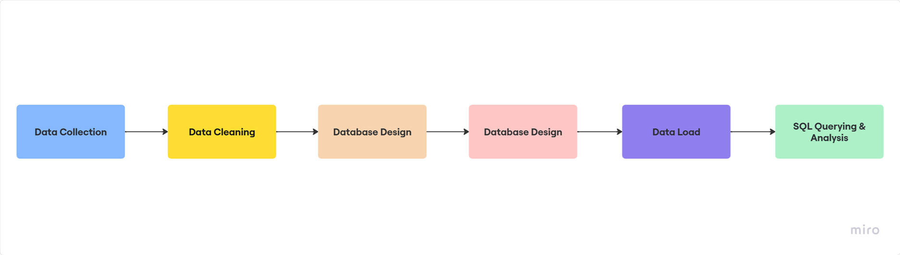
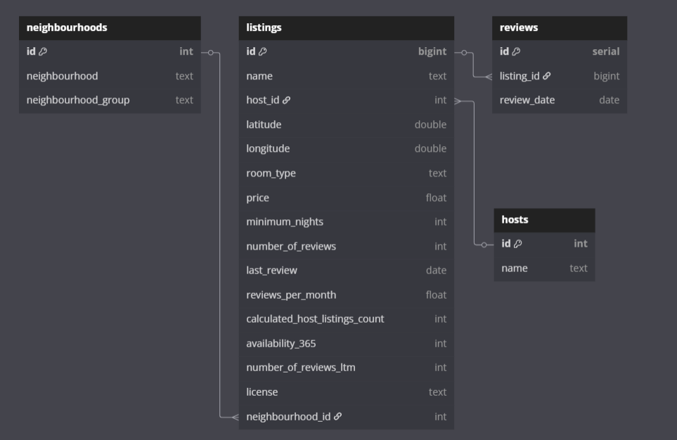

# 🏙️ New York Airbnb Data Analysis Using SQL

This project presents an end-to-end data analysis pipeline for Airbnb listings in **New York City**, focused on uncovering insights using **PostgreSQL** and **SQL querying**. From raw data to database design, transformation, and advanced SQL-based exploration, the project showcases strong skills in **data cleaning**, **database normalization**, and **analytical thinking**.

---

## 🎯 Project Objective

To analyze **Airbnb listings in NYC** and uncover:

- 🏷️ Pricing trends  
- 🛏️ Popular room types  
- 🌆 High-earning neighborhoods  
- 💬 Guest review patterns  

This project demonstrates expertise in **relational database design**, **data wrangling using Python**, and **insightful SQL query development**.

---

## 📂 Dataset

The dataset is sourced from the publicly available **[Inside Airbnb platform](https://insideairbnb.com/get-the-data/)** and includes:

- 📌 Listings
- 🏘️ Neighbourhoods  
- 🗓️ Reviews  
---

## 🔄 Project Workflow

---

## 🛠️ Tech Stack

- **SQL** (PostgreSQL)
- **Python** (Pandas for data cleaning)
- **pgAdmin** / `psql` (PostgreSQL GUI and CLI)
- **dbdiagram.io** (for ERD schema design)

---

## 🧱 Database Schema

The schema is fully normalized with the following tables:

- `listings`
- `hosts`
- `neighbourhoods`
- `reviews`

> Foreign keys were used to establish relationships and maintain data integrity.

 <!-- Replace with actual ERD path -->

---

## 🧹 Data Cleaning & Loading

- Cleaned raw CSVs using **Pandas**
- Removed duplicates and nulls
- Standardized data types
- Mapped `neighbourhoods` to foreign keys
- Loaded into PostgreSQL using `\copy` for efficient import

---

## 📊 Key SQL Insights

| 🔍 Insight Type     | 💡 Query Description                          |
|---------------------|-----------------------------------------------|
| 💵 Pricing Analysis | Avg. price by neighbourhood and room type     |
| 🛏️ Room Types       | Most popular room types                       |
| 📍 Location Trends   | Top 5 most expensive neighbourhoods           |
| 📈 Review Trends     | Monthly review volume using `DATE_TRUNC`     |
| 🤖 Host Analysis     | Hosts with the most listings                  |
| ❗ Outlier Detection | High-priced listings with low/no reviews      |

